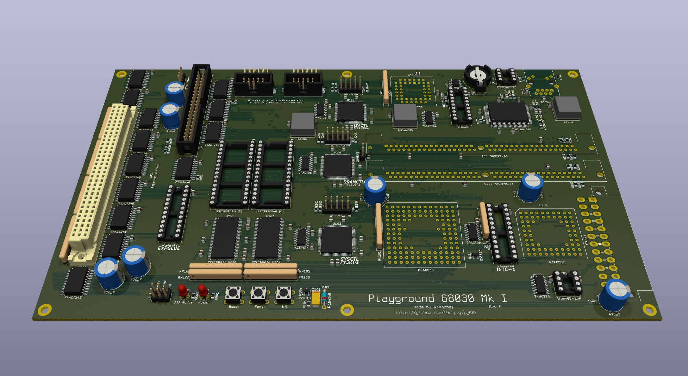

# Playground 68030 Mk I

The 68030 Mk I is intended as a relatively modest Unix machine.  It
sports the following features:

* 68030 CPU + 68882 FPU running at 25MHz.
* Up to 256MB of 60ns dynamic RAM (as 2x 128MB 72-pin SIMMs).
* 4MB of 10ns static RAM.
* 1MB of flash ROM containing system firmware.
* 2 16550-compatible serial ports (provided by a TL16C2552).
* An ATA disk interface supporting 1 or 2 drives.
* A 10Mb/s twisted pair Ethernet interface (provided by an RTL8019AS).
* An I2C interface (provided by a PCF8584) and real-time clock/calendar
  with battery backup (provided by a DS3231).
* A system timer.
* An expansion port with limited bus master capability.
* An interrupt controller that supports 6 open-drain level-triggered
  interrupt inputs with a global interrupt enable/disable control, plus
  a non-maskable interrupt.
* An ATX power supply with a microcontroller that provides software-
  controlled power-off and system reset.

The system is built around 3 ATF1508AS CPLDs: SYSCTL (system controller),
DRAMCTL (DRAM controller), and ISACTL (ISA bus cycle controller).  All
timing is derived from a 50MHz crystal oscillator that directly clocks
the DRAM controller and is divided down by other controllers to provide
the CPU (and bus) clock, the I2C clock, and the system timer base clock.

The system makes extensive use of the 68030's dynamic bus sizing
mechanism.  This allows the peripheral address space to be densely-
packed and for 16-bit little-endian peripherals (such as ATA disks and
the Ethernet interface) to be handled rationally:

* DRAM and SRAM are 32-bit ports.
* The flash ROM is a 16-bit port (2 chips, "even" and "odd").
* ISA-type peripherals are dynamically 8- or 16-bit ports, depending
  on each individual access width, with some constraints to be
  discussed below.
* The I2C controller is an 8-bit port that natively supports the
  68030 bus protocol.
* The PSU controller is an 8-bit port.

A couple of things that are useful to keep in mind when reading the
rest of this document and reading the schematic:

* D0-D31 are pulled up to Vcc; any data line not driven by a selected
  device will read as 1.
* Several CPU control inputs are pulled up to Vcc and driven with open-drain
  outputs: /DSACKn, /STERM, /BERR, /CI, /CBACK.
* The CPLDs that drive these signals use active-high outputs that are
  inverted by 74ACT05 open-drain inverters; this was done because I had
  trouble with the Atmel fitter crashing when attempting to use the
  open-collector output feature of the ATF1508AS (or even faking it using
  tri-state outputs in the Verilog).  If I can get the tools working
  properly, this may change in a future revision of the board.

## Clocks and reset generation

There are 3 oscillators on the Mk I:

* 50MHz - This clocks the DRAM and is divided by the system controller
  for other clocks, including the CPU clock.
* 20MHz - This is clock source for the 10Mb/s Ethernet interface.
* 1.8432MHz - This is the baud rate clock for the DUART.

Reset generation is handled by a DS1813 reset supervisor.  This handy
little IC has an internal pull-up resistor for /RESET and monitors
the signal as well as Vcc.  If /RESET is pulled low or if Vcc drops
below a threshold voltage (such as in a brown-out condition), then
the DS1813 pulls /RESET low for 150ms.  The DS1813 draws very little
current, typically 30uA, and its power is supplied by the PWR_OK signal
from the ATX power supply.  This ensures that /RESET is asserted until
the power supply is stable.

The system controller is reponsible for dividing the DRAM clock into
other clocks.  It's important for those clocks to be stable and running
when other devices come out of a reset condition.  As such, the counter
used to divide the clock cannot reset with the /RESET signal, meaning
that the value in the counter will be undefined at power-on.  So, the
initial power-on-reset is elongated using an RC circuit on the DS1813's
Vcc pin.  This provides plenty of time for the system controller's
clock divider counter to run and get into a rational state before other
devices begin consuming the clocks.  A reverse-biased diode provides
a fast discharge path for the capacitor when the system is powered off.

## SYSCTL - The system controller

The system controller has 6 major functions:

* A clock divider, providing 25MHz and 6.25MHz clocks dervied from the
  50MHz DRAM clock.
* Top-level address decoding, plus address decoding for the on-board
  peripherals that natively support the 68030 bus protocol.
* Zero-wait-state interface to the SRAM.
* A bus cycle state machine for ROM and PSU controller accesses.
* Bus error generation.
* Miscellaneous logic.

The system controller logic is written in Verilog and synthesized for
the Atmel ATF1508AS-7 CPLD in a TQFP-100 package using Yosys and the
Atmel fitter tool.

### Clock divider

The clock divider is implemented as a 3-bit counter that increments
on the rising edge of the DRAM_CLK input.  The CPU_CLK output is
taken from bit 0 of the counter (thus dividing the input by 2) and
the CLK_6_25 output is taken from bit 2 (thus dividing the output by 8).
You can find the block of code that does this by looking for `ClockDivider`
in [sysctl.v](cpld-files/sysctl.v).

### Address decoding

The address decoder is responsible for decoding the 68030 function code
and address and asserting the appropriate select signal outputs.  The
top-level address map is as follows:

| Address range           | Function                   |
|-------------------------|----------------------------|
| $FFF0.0000 - $FFFF.FFFF | System ROM (1MB)           |
| $FFE0.0000 - $FFEF.FFFF | On-board peripherals (1MB) |
| $FE00.0000 - $FE3F.FFFF | Fast SRAM (4MB)            |
| $8000.0000 - $80FF.FFFF | Expansion port (16MB)      |
| $0000.0000 - $3FFF.FFFF | DRAM (1GB, as 4x256MB)     |

This doesn't quite tell the whole story, though.  The 68k qualifies every
address with a function code on the FC[2..0] bus signals.  The codes are
as follows:

| FC2 | FC1 | FC0 | Address space            |
|-----|-----|-----|--------------------------|
|  0  |  0  |  0  | (Undefined, reserved)    |
|  0  |  0  |  1  | User data space          |
|  0  |  1  |  0  | User program space       |
|  0  |  1  |  1  | (Undefined, reserved)    |
|  1  |  0  |  0  | (Undefined, reserved)    |
|  1  |  0  |  1  | Supervisor data space    |
|  1  |  1  |  0  | Supervisor program space |
|  1  |  1  |  1  | CPU space                |

The system controller decodes these signals and classifies every bus
cycle into two types:

* User data, user program, supervisor data, and supervisor program are
  classified as "Normal".  Normal space is subdivided per the address
  map above.
* CPU space is classified as "CPU".  CPU space is, among other things,
  used for interrupt acknowledgement and co-processor access.

The three undefined functions are not decoded and, since they do not
assert any select outputs, will ultimately generate a bus error.

Addresses are normally qualified with the /AS signal from the CPU.  However,
there is one special case that is needed to achieve zero-wait-state FPU
bus cycles.

There is one additional twist to address decoding: handling of the reset
vector fetch.  Upon reset, the CPU fetches two longwords located at
$0000.0000 (initial stack pointer) and $0000.0004 (reset PC).  Those memory
locations are normally in DRAM.  To handle this situation, the system
controller counts the first 4 bus cycles after a reset and sets an internal
signal indicating that a reset vector fetch is occurring.  The address
decoding logic uses this internal signal to select the ROM rather than DRAM
during these 4 bus cycles.  Why 4?  Because the ROM is a 16-bit port, and
thus 4 bus cycles are required to read the 2 long words.  You can find the
the block of code that does this by looking for `BootState` in
[sysctl.v](cpld-files/sysctl.v).

The actual top-level address decode is performed using a `casex` statement
that combines the address space, qualifiers, internal reset vector fetch
signal, and address bits A13 through A31.  Search for `SpaceNormal` in
[sysctl.v](cpld-files/sysctl.v) and keep reading through the assignment of
`nROMSEL` to see all of the code that performs this task.

A couple of additional things to note:

* The system controller supports up to 4 DRAM blocks of 256MB.  Each of
  these DRAM blocks are expected to be contiguous within its block,
  but each block always begins on a 256MB boundary.  Thus, if any given
  block is not fully populated, then then system memory will be non-
  contiguous overall.  On the Mk I, however, the issue is moot; only
  1 DRAM block is present on the system.

* Fast SRAM selection is not handled by the top-level address decoder;
  that task is done in the fast SRAM interface described below.

The on-board peripherals region is further subdivided into an ISA I/O
region (which is handled by the ISACTL CPLD) plus 3 individual device
select outputs: I2C controller, PSU controller, and interrupt controller.
You can find the block of code that does this by looking for `DevSelectOutputs`
in [sysctl.v](cpld-files/sysctl.v).

### Fast SRAM interface

The system has 2 CY7C1061GE 10ns SRAM chips.  These are 1Mx16, resulting
in 4MB, with one chip handling the upper 16 bits of the 32-bit longword
and the other handling the lower 16 bits.

The 68030 supports a zero-wait-state synchronous bus cycle that can be
used to read and write fast SRAM.  Historically, this was used to implement
external caches (HP being a notable example where this technique was used
on the 9000/345, 9000/370, 9000/375, and 9000/400).  The Mk I, however,
does not use it that way, rather it is simply a 4MB region of fast RAM
that the operating system can use as it sees fit (placing MMU page tables
here would be a good idea and would provide system-wide performance
benefits since the MMU has to access the page tables quite frequently).

These fast bus cycles are terminated not with the /DSACKn signals but
rather with the /STERM signal, which has some specific setup time
constraints described in the 68030 manual.

Motorola provides a fantastic example of how to use this bus cycle
to access fast SRAM in their application note
[ANE426](http://www.bitsavers.org/components/motorola/_appNotes/ANE-426_An_MC68030_32-Bit_High_Performance_Minium_System_%5BMotorola_2004_8p%5D.pdf).
The upshot of the whole thing is that the /STERM signal must be asserted
**as soon as the address is decoded** in oder to achieve zero-wait-state
operation.  Because of the timing constraints, use of this bus cycle
precludes the use of data bus buffers between the CPU and the fast SRAM.

The fast SRAM interface is wired up to the 68030's cache burst cycle
related signals (/CBREQ and /CBACK), but does not participate in them
at this time.  This is something that may be added later.

Bus cycles terminated with /STERM do not use the 68030's dynamic bus sizing
mechanism and are always 32-bit.  As such, it is important to decode the
SIZn signals and lower two address bits (A0 and A1) in order to assert the
correct byte enable outputs during write cycles.  Both ANE426 and the 68030
manual provide the logic description (and even PAL equations) for this.
In our case, it's all implemented using a `casex` statement.  Reads always
generate all 32 bits; only writes need be concerned with the byte enables.
You can find the the block of code that implements the fast SRAM interface
by looking for `FRSOutputs` in [sysctl.v](cpld-files/sysctl.v).

### Bus cycle state machine

The ROM and PSU controller do not natively support the 68030 bus protocol
and also do not fall under the control of the other 2 controller CPLDs,
so the system controller implements a bus cycle state machine to handle
these devices.  The state machine is clocked by the CPU clock and has
only 4 states:

* **Idle** - If the ROM is selected, a 2-byte 1-wait-state cycle is
  requried; transition to **B2W1**.  If the PSU controller is selected,
  a 1-byte 1-wait-state cycle is required; transition to **B1W1**.
* **B1W1** - Assert /DSACK0 to indicate a 1-byte port.  Transition to
  **Finish**.
* **B2W1** - Assert /DSACK1 to indicate a 2-byte port.  Transition to
  **Finish**.
* **Finish** - If the CPU has finished the cycle by de-asserting /DS,
  then de-assert /DSACKn and transition to **Idle**.  Otherwise, remain
  in **Finish**, waiting for the CPU to finish the cycle.

The system controller's /DSACKn outputs are qualified with the /DS
signal from the CPU to ensure that they do not remain asserted on the
system bus after the CPU has finished the cycle.

You can find the the block of code that implements the bus cycle state
machine by looking for `BCState` in [sysctl.v](cpld-files/sysctl.v).

### Bus error generation

Because the 68030 bus is fundamentally asynchronous, there needs to be
something keeping watch to terminate a bus cycle in the event that nothing
responds.  As such, the system controller maintains a 6-bit counter of
the number of CPU clock cycles in each bus cycle.  When a bus cycle
terminates as indicated by the CPU de-asserting /AS, the counter resets
to 0.  If the counter reaches 63 (indicating that 64 clock cycles have
elapsed), the system controller asserts /BERR and stops incrementing
the counter.  Eventually, the CPU will then terminate the cycle and
the counter will reset.

You can find the the block of code that implements this by looking for
`BerrState` in [sysctl.v](cpld-files/sysctl.v).

### Miscellaneous logic

There are some miscellaneous signals generated by the system controller:

* Active-high RESET: This is simply the system /RESET signal inverted for
  the on-board peripherals that require it (DUART and Ethernet).
* /CI: When the on-board peripheral space is selected or during the reset
  vector fetch, the system controller asserts the /CI signal to prevent
  the CPU from caching the result of the bus cycle.

## Interrupt controller

The interrupt system on the Mk I is very simple: there are 7 active-low
level-sensitive interrupt lines, /INT1 - /INT7.  They are pulled up to Vcc
and are intended to be driven by open-drain outputs, allowing for a wired-OR
configuration.  Each /INTn line corresponds directly to a 68030 interrupt
priority level.  The interrupt controller is little more than a simple
priority encoder that outputs the correct combination of /IPL0, /IPL1, and
/IPL2 corresponding to the highest-priority interrupt line being asserted.
Additionally, it has /INTCSEL (for reads and writes to the interrupt controller
"enable" register) and /INTACKSEL (for handling a CPU interrupt-acknowledge
bus cycle, at which point the interrupt controller asserts its /AVEC output,
telling the CPU to use auto-vectored interrupts).

/INT1 - /INT6 are assigned to peripherals on the system, based on a
priority hierarchy that's Unix-friendly:

* The ATA interrupt is connected to /INT3.
* The Ethernet interrupt is connected to /INT4.
* The DUART and I2C interrupts are connected to /INT5.
* The system timer interrupt is connected to /INT6.

/INT1 and /INT2 are not connected to on-board peripherals, and only /INT2
is brought out to the expansion port (/INT1 was elided due to a shortage
of pins).

/INT7 is the non-maskable interrupt and is connected to a DS1813 reset
supervisor and a push-button, used to generate an NMI for debugging
purposes.  The DS1813 de-bounces the push-button and generates a 150ms
long pulse that should be more than enough time for the CPU to respond
to the interrupt before it's de-asserted.

For peripherals with active-high interrupt outputs (DUART, Ethernet, system
timer), a 74ACT05 open-drain inverter is placed between the peripheral and
the interrupt controller.  In the case of the DUART, its active-high interrupt
outputs are OR'd together using a 74HCT32, mainly ease signal routing.  This
ended up not being that important in practice, so a future revision of the
board may eliminate the 74HCT32 and simply run both of them to the inverter
and wire-OR them after.

The interrupt controller has a single global interrupt enable bit that,
when clear, suppresses /INT1 - /INT6; the NMI is not affected by the
interrupt enable bit.  This bit can be read or written with a single byte
bus cycle, and will be bit 0 of that byte.  The interrupt controller natively
supports the 68030 bus protocol.

The interrupt controller is implemented in a GAL22V10 and the equations can
be found in [intc-1.gal](gal-files/intc-1.gal).

## Dynamic RAM

The DRAM controller is responsible for converting the linear addressing
used by the 68030 into the row/column addressing used by 72-pin non-parity
SIMMs, in addition to periodically performing memory refresh cycles and
interleaving them with CPU accesses.  It is capable of controlling 1 or 2
60ns 72-pin non-parity SIMMs that use 11 or 12 address bits, so 16MB,
32MB, 64MB, or 128MB; any other 72-pin SIMM capacity is not supported.
If 2 SIMMs are installed, both must be the same configuration.

The DRAM controller logic is written in Verilog and synthesized for
the Atmel ATF1508AS-7 CPLD in a TQFP-100 package using Yosys and the
Atmel fitter tool.

Throughout this section, you might find it handy to have a copy
of [dramctl.v](cpld-files/dramctl.v) handy.

DRAM controllers are not particularly complex, logically, but they use
a lot of I/O pins.  There are 28 incoming address lines from the CPU,
plus clock, reset, and bus cycle control signals.  On the DRAM side,
there are 8 Presence Detect pins (4 per SIMM), a "SIMM size" jumper input,
12 DRAM address lines, 8 RAS lines (4 per SIMM), and 8 CAS lines (4 per
SIMM).  Use of individual RAS+CAS lines for each SIMM rather than multiplexing
them allows both SIMMs to be refreshed in parallel.

The DRAM controller uses the "SIMM size" jumper and the Presence Detect pins
on the SIMMs to compute the SIMM size.  Supported 72-pin SIMMs use either
11 or 12 address bits and have 1 or 2 "ranks" (sides, basically).  The
Presence Detect pins are pulled-up to Vcc at the SIMM socket and the SIMM
selectively connects those pins to GND on the SIMM.  Similarly, the SIMM
size input on the DRAM controller is pulled up to Vcc and when the jumper is
installed, the pin is connected to GND.  With that in mind, here are the
supported SIMM sizes and their Presence Detect values:

| SIMM SZ | PD1 | PD2 | Capacity | Configuration |
|---------|-----|-----|----------|---------------|
|    1    |  0  |  1  |   16MB   | 11-bit 1-rank |
|    1    |  1  |  0  |   32MB   | 11-bit 2-rank |
|    0    |  0  |  1  |   64MB   | 12-bit 1-rank |
|    0    |  1  |  0  |  128MB   | 12-bit 2-rank |

The PD3 and PD4 inputs from each SIMM are used to communicate the speed
of the SIMM.  The Mk I's DRAM controller only supports 60ns DRAM, so both
PD3 and PD4 must be 1.  See `ValidFirstSIMM`.

In order to simplify the addressing logic, the DRAM controller requires
that both SIMMs be identical.  See `ValidSecondSIMM`.

For SIMMs SIMMs that use a given number of address bits (either 11 or 12),
the size is determined by how many rows are present.  Rows are selected in
pairs, so a SIMM has either 2 or 4 rows.  But the row address calculcation
is always the same for any SIMM with the same number of address bits.  The
difference between a 1-rank and 2-rank SIMM is whether or not there is any
memory present on the second set of row-selects.  The second set of row
selects is selected when the address exceeds the size of the first rank, so
it can simply be extracted from an address bit and inverted or not, based
on which rows we're selecting.  See `RowAddress`, `ColumnAddress`, and
`nRowSelects`.

Next, the DRAM controller needs to know which SIMM to select.  This is
based on whether or not the address has exceeded the capacity of the first
SIMM.  See `SecondSIMM`.

Finally, the DRAM controller needs to know if the requested address fits
within the memory size.  For this, `FitsSecondSIMM` is used in conjunction
with `SecondSIMM` in order to compute `ValidAddress`.

As with the fast SRAM interface in the system controller, the DRAM
controller needs to select specific byte enables during write cycles.
These byte enables are used to assert the column-select signals during
the cycle.  The logic is identical to the fast SRAM case; see `ByteEnables`.

Before we cover the DRAM state machine, a quick note about refresh cycles.
The DRAM is clocked at 50MHz, giving us a 20ns clock period.  Standard
DRAM rows want to be refreshed within 32ms.  With 12 address bits, that's
a maximum of 4096 rows, which means a row needs to be refreshed once every
7.8125us, which is 390 clock cycles.  Because we're interleaving DRAM refresh
with normal memory read/write cycles, we give ourselves a 16 clock cycle
margin to work with; see `REFRESH_CYCLE_CNT`.  This is just a free-running
counter that sets a "refresh requested!" flag whenever the counter reaches
the limit.  The state machine will process the refresh request and
acknowledge it.

And now, on to the DRAM state machine.  There are 12 states: **IDLE**,
**RW1** - **RW5**, **REFRESH1** - **REFRESH4**, **PRECHARGE**, and
**BERRWAIT**.  Each state represents 20ns, except for **IDLE**, **RW5**,
and **BERRWAIT**, which can linger for multiple time slices.  Also keep
in mind that the non-blocking assignments (`<=`) in the Verilog all
happen simultaneously at the very moment the current time slice ends
and the next one begins.

We start in the **IDLE** state.  The DRAM controller hangs out here
waiting for something to do: either a request to perform a refresh
cycle (from the refresh counter discussed above), or a request to
perform a memory access.  We'll start with the refresh cycle, because
the DRAM prioritizes those over memory accesses.

### Refresh cycle

While in **IDLE**, if a refresh cycle is requested, we set the next state to
**REFRESH1** to initiate a CAS-before-RAS refresh cycle.  In this type
of refresh cycle, the DRAM itself maintains a row counter so that we
don't have to.  Any DRAM modern enough to be on a 72-pin SIMM supports
this.  Note that we don't assert CAS during the transition to **REFRESH1**
because **IDLE**'s first time slice is part of the precharge time from any
previous access or refresh cycle.

In **REFRESH1**, we acknowledge the refresh request, assert all 4 CAS lines
on both SIMMs, and transition to **REFRESH2**.

In **REFRESH2**, we assert all 4 RAS lines on both SIMMs and trasition to
**REFRESH3**.

In **REFRESH3**, we de-assert CAS and transition to **REFRESH4**.

In **REFRESH4**, we de-assert RAS, mark the fresh cycle as complete, and
transition to **PRECHARGE**

**PRECHARGE** is a wait state that's needed to reset the column voltage
to the midpoint; all we do here is transition to **IDLE**.  For 60ns DRAM,
we need 40ns of precharge time, so we get 20ns in the **PRECHARGE** state,
and another 20ns in the next **IDLE**.

### Memory access cycle

While in **IDLE** and no refresh cycle has been requested, we check
if DRAM as been selected by the address decoder.  If so, we next check
the address; if it's valid, we set the DRAM address lines to the row
address and transition to **RW1**.  Otherwise, we signal a bus error
and transition to **BERRWAIT**.

In **RW1**, we assert the appropriate RAS lines, set the DRAM /WR
signal according to the R/W input, and transition to **RW2**.

In **RW2**, we set the DRAM address lines to the column address
and transition to **RW3**.

In **RW3**, we set the appropriate set of CAS lines according to the
byte enables and transition to **RW4**.

In **RW4**, we terminate the bus cycle by asserting /DSACK0 and /DSACK1
and transition to **RW5**.

In **RW5**, we wait for /AS to be de-asserted, and once that happens,
we de-assert all of our DRAM control signals, /DSACKn, and transition
to **PRECHARGE**, which was discussed in the description of the refresh
cycle.

**BERRWAIT** is where bad memory access cycles go to die.  We wait
here until /AS is de-asserted, then de-assert /BERR and trandition
back to **IDLE**.

## ISA peripherals and system timer

XXX

## I2C interface

XXX

## PSU controller

XXX

## Expansion interface

XXX

## System firmware

XXX
